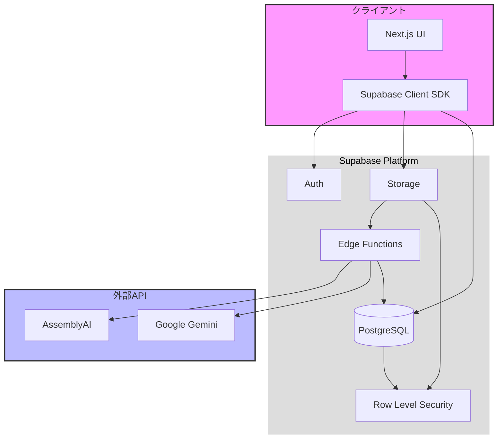
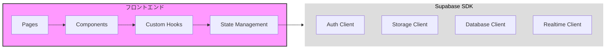
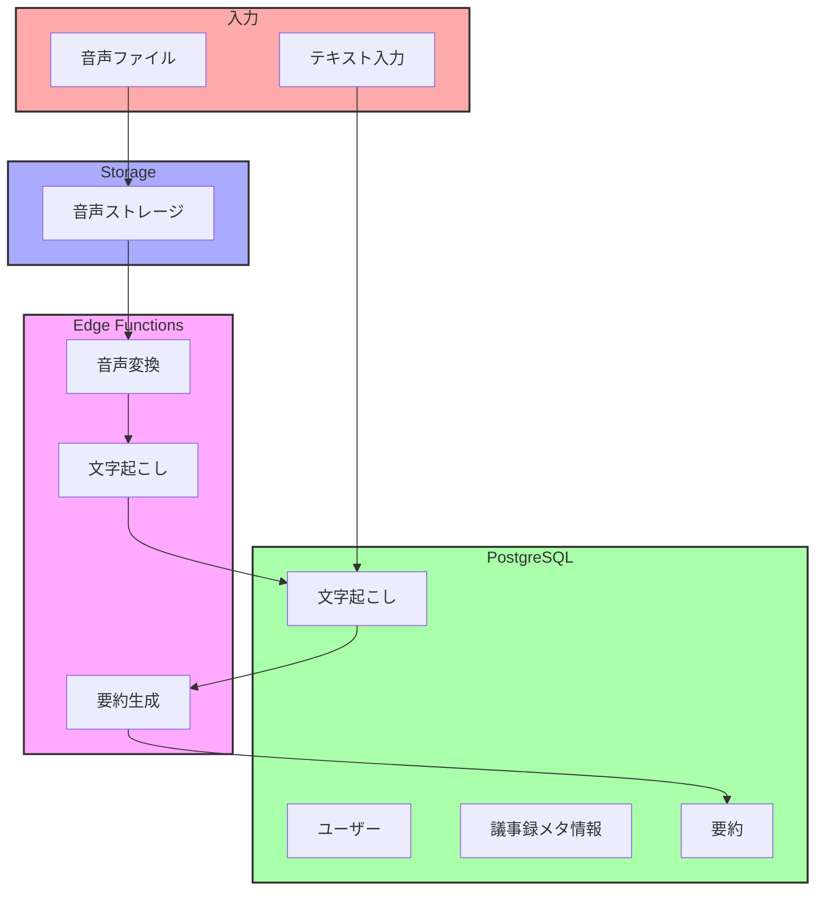
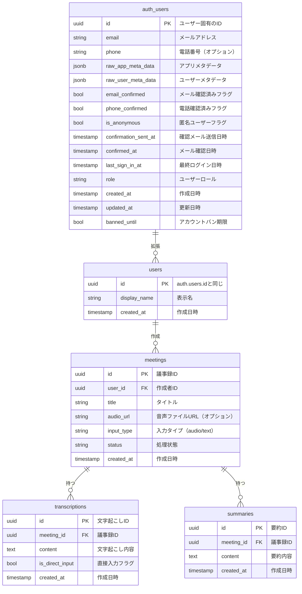
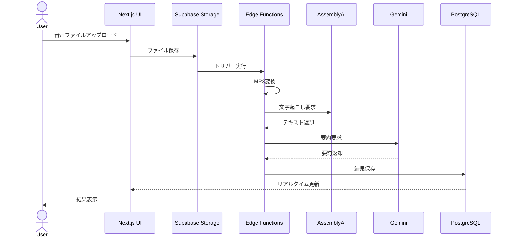
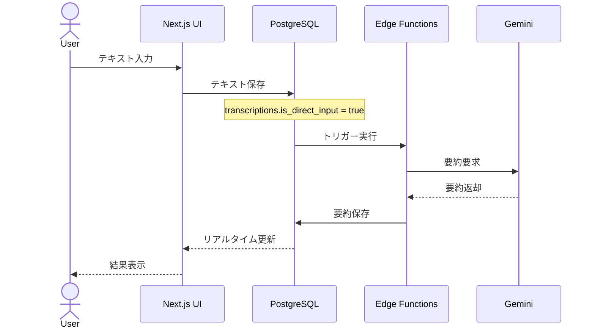
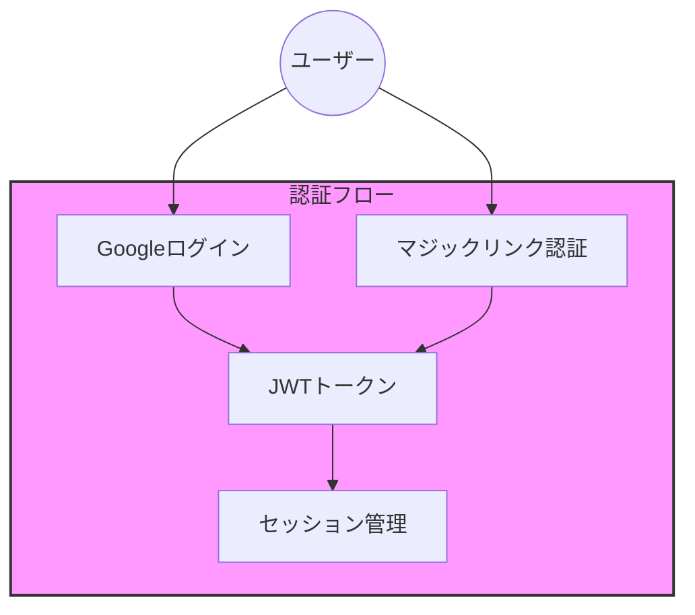

# システムアーキテクチャ設計書

## 1. 全体構成図



## 2. コンポーネント詳細

### 2.1 フロントエンド層



### 2.2 バックエンド層



## 3. データモデル

### 3.1 テーブル構造



### 3.2 認証スキーマ解説

Supabaseでは`auth.users`スキーマに認証情報が自動で管理されます：

#### 3.2.1 重要なカラム解説

1. **基本情報**
   - `id`: ユーザー固有のUUID（全テーブルの紐付けに使用）
   - `email`: ログイン用メールアドレス
   - `role`: デフォルトは'authenticated'

2. **メタデータ**
   - `raw_app_meta_data`: アプリケーション管理データ（プロバイダ情報など）
   - `raw_user_meta_data`: ユーザー関連データ（Googleプロフィール情報など）

3. **認証状態**
   - `email_confirmed`: メール確認済みかどうか
   - `last_sign_in_at`: 最終ログイン日時
   - `confirmed_at`: メール確認完了日時

#### 3.2.2 メタデータの例

```json
// raw_app_meta_data の例
{
  "provider": "google",
  "providers": ["google"],
  "role": "authenticated"
}

// raw_user_meta_data の例（Googleログイン時）
{
  "avatar_url": "https://lh3.googleusercontent.com/...",
  "email": "user@gmail.com",
  "email_verified": true,
  "full_name": "山田太郎",
  "iss": "https://accounts.google.com",
  "name": "山田太郎",
  "picture": "https://lh3.googleusercontent.com/..."
}
```

これらのデータは自動的に管理され、アプリケーションからは参照のみ可能です。

## 4. 処理フロー

### 4.1 音声文字起こしフロー



### 4.2 テキスト直接入力フロー



## 5. セキュリティ設計

### 5.1 認証方式



#### 5.1.1 認証方式詳細

1. **Googleログイン**
   - メイン認証方式として提供
   - ワンクリックでのアカウント作成・ログイン
   - プロフィール情報（表示名、アバター）の自動取得

2. **マジックリンク認証**
   - セカンダリ認証方式として提供
   - パスワードレスでの認証
   - メールアドレスのみでログイン可能
   - 有効期限付きの認証リンクをメールで送信

#### 5.1.2 認証フロー

1. **Googleログインフロー**
   ```mermaid
   sequenceDiagram
       actor User
       participant UI
       participant Supabase
       participant Google
       
       User->>UI: Googleログインボタンクリック
       UI->>Supabase: signInWithOAuth(google)
       Supabase->>Google: リダイレクト
       Google-->>User: 認証ダイアログ
       User->>Google: 認証情報入力
       Google-->>Supabase: 認証情報
       Supabase-->>UI: JWTトークン
       UI-->>User: ログイン完了
   ```

2. **マジックリンクフロー**
   ```mermaid
   sequenceDiagram
       actor User
       participant UI
       participant Supabase
       participant Email
       
       User->>UI: メールアドレス入力
       UI->>Supabase: signInWithOtp(email)
       Supabase->>Email: マジックリンク送信
       Email-->>User: 認証メール
       User->>UI: リンククリック
       UI->>Supabase: トークン検証
       Supabase-->>UI: JWTトークン
       UI-->>User: ログイン完了
   ```

### 5.2 RLSポリシー

```sql
-- meetings テーブルのRLSポリシー例
CREATE POLICY "ユーザーは自分の議事録のみ参照可能" ON meetings
    FOR SELECT
    USING (auth.uid() = user_id);

CREATE POLICY "ユーザーは自分の議事録のみ作成可能" ON meetings
    FOR INSERT
    WITH CHECK (auth.uid() = user_id);
```

## 6. 監視設計

- Supabase Dashboardでの監視項目
  - ストレージ使用量
  - データベース接続数
  - Edge Functions実行回数
  - 認証アクティビティ
  - APIリクエスト数

## 7. デプロイメント

- Vercel: フロントエンド（Next.js）
- Supabase: バックエンド全般
  - Database
  - Storage
  - Edge Functions
  - Authentication 