# システムアーキテクチャ設計書

## 1. 全体構成図

```mermaid
graph TB
    subgraph Client["クライアント"]
        UI[Next.js UI]
        SDK[Supabase Client SDK]
    end

    subgraph Supabase["Supabase Platform"]
        Auth[Auth]
        Storage[Storage]
        DB[(PostgreSQL)]
        Edge[Edge Functions]
        RLS[Row Level Security]
    end

    subgraph ExternalAPI["外部API"]
        Assembly[AssemblyAI]
        Gemini[Google Gemini]
    end

    UI --> SDK
    SDK --> Auth
    SDK --> Storage
    SDK --> DB
    
    Storage --> Edge
    Edge --> Assembly
    Edge --> Gemini
    Edge --> DB

    DB --> RLS
    Storage --> RLS
    
    classDef platform fill:#ddd,stroke:#fff,stroke-width:4px,color:#000;
    classDef client fill:#f9f,stroke:#333,stroke-width:2px;
    classDef external fill:#bbf,stroke:#333,stroke-width:2px;
    
    class Supabase platform;
    class Client client;
    class ExternalAPI external;
```



## 2. コンポーネント詳細

### 2.1 フロントエンド層


### 2.2 バックエンド層


## 3. ドメインモデリング

### 3.1 ユビキタス言語


### 3.2 ドメインオブジェクト定義

#### 3.2.1 ユーザー (User)
- **定義**: システムを利用する個人
- **属性**:
  - ID: システム内でのユニーク識別子
  - 表示名: UI表示用の名前
  - 認証情報: ログインに使用される情報

#### 3.2.2 会議 (Meeting)
- **定義**: 議事録を作成する対象となる会議や打ち合わせ
- **属性**:
  - ID: 会議の固有識別子
  - タイトル: 会議の名称
  - 作成日時: 記録が作成された日時
  - 入力タイプ: 音声/テキストの区分
  - ステータス: 処理状態（待機中/処理中/完了/エラー）
  - 音声URL: 音声ファイルの保存場所（音声入力の場合）

#### 3.2.3 文字起こし (Transcription)
- **定義**: 会議の発言内容を文字に起こしたもの
- **属性**:
  - 内容: 文字起こしされたテキスト
  - 直接入力フラグ: ユーザーからの直接入力かどうか
  - 作成日時: 文字起こしが完了した日時

#### 3.2.4 要約 (Summary)
- **定義**: 文字起こしから生成された会議内容の要点
- **属性**:
  - 内容: 要約されたテキスト
  - 作成日時: 要約が生成された日時

### 3.3 ドメインサービス

#### 3.3.1 文字起こしサービス (TranscriptionService)
- **責務**: 音声データから文字起こしを生成
- **主要処理**:
  - 音声ファイル変換: 様々な形式からMP3への統一変換
  - 文字起こし要求: AssemblyAIへのAPI呼び出し
  - 文字起こし保存: 結果のデータベース格納

#### 3.3.2 要約サービス (SummaryService)
- **責務**: 文字起こしから重要なポイントを抽出し要約を生成
- **主要処理**:
  - 要約生成: Gemini APIへのテキスト送信と要約取得
  - 要約保存: 生成された要約の保存

#### 3.3.3 会議管理サービス (MeetingManagementService)
- **責務**: 会議情報の作成・更新・削除を管理
- **主要処理**:
  - 会議作成: 新規会議レコード作成
  - ステータス管理: 処理状況の更新
  - 関連リソース管理: 関連する文字起こし・要約の紐付け

### 3.4 ドメインイベント


### 3.5 ビジネスルール

1. **ユーザーアクセス制御**
   - ユーザーは自分が作成した会議のみアクセス可能
   - 会議の作成者のみが編集・削除可能

2. **処理フロー制約**
   - 音声入力の場合、変換→文字起こし→要約の順で処理
   - テキスト直接入力の場合、文字起こしをスキップして要約を生成
   - 処理中のステップはキャンセル可能だが、完了したステップはやり直し必要

3. **データ整合性ルール**
   - 会議レコードは必ずユーザーに紐付く
   - 文字起こしと要約は必ず会議に紐付く
   - 会議が削除されると、関連する文字起こしと要約も削除される（カスケード）

4. **入力検証ルール**
   - 音声ファイルは100MB以下のサイズ制限
   - サポート形式は .mp3, .m4a, .wav, .ogg
   - テキスト入力は最低10文字以上必要

5. **処理タイムアウトルール**
   - 文字起こし処理は最大30分でタイムアウト
   - 要約生成は最大5分でタイムアウト
   - タイムアウト時はエラーステータスに遷移

## 4. データモデル

### 4.1 テーブル構造


### 4.2 認証スキーマ解説

Supabaseでは`auth.users`スキーマに認証情報が自動で管理されます：

#### 4.2.1 重要なカラム解説

1. **基本情報**
   - `id`: ユーザー固有のUUID（全テーブルの紐付けに使用）
   - `email`: ログイン用メールアドレス
   - `role`: デフォルトは'authenticated'

2. **メタデータ**
   - `raw_app_meta_data`: アプリケーション管理データ（プロバイダ情報など）
   - `raw_user_meta_data`: ユーザー関連データ（Googleプロフィール情報など）

3. **認証状態**
   - `email_confirmed`: メール確認済みかどうか
   - `last_sign_in_at`: 最終ログイン日時
   - `confirmed_at`: メール確認完了日時

#### 4.2.2 メタデータの例

```json
// raw_app_meta_data の例
{
  "provider": "google",
  "providers": ["google"],
  "role": "authenticated"
}

// raw_user_meta_data の例（Googleログイン時）
{
  "avatar_url": "https://lh3.googleusercontent.com/...",
  "email": "user@gmail.com",
  "email_verified": true,
  "full_name": "山田太郎",
  "iss": "https://accounts.google.com",
  "name": "山田太郎",
  "picture": "https://lh3.googleusercontent.com/..."
}
```

これらのデータは自動的に管理され、アプリケーションからは参照のみ可能です。

## 5. 処理フロー

### 5.1 音声文字起こしフロー


### 5.2 テキスト直接入力フロー


## 6. セキュリティ設計

### 6.1 認証方式


#### 6.1.1 認証方式詳細

1. **Googleログイン**
   - メイン認証方式として提供
   - ワンクリックでのアカウント作成・ログイン
   - プロフィール情報（表示名、アバター）の自動取得

2. **マジックリンク認証**
   - セカンダリ認証方式として提供
   - パスワードレスでの認証
   - メールアドレスのみでログイン可能
   - 有効期限付きの認証リンクをメールで送信

#### 6.1.2 認証フロー

1. **Googleログインフロー**
   ```mermaid
   sequenceDiagram
       actor User
       participant UI
       participant Supabase
       participant Google
       
       User->>UI: Googleログインボタンクリック
       UI->>Supabase: signInWithOAuth(google)
       Supabase->>Google: リダイレクト
       Google-->>User: 認証ダイアログ
       User->>Google: 認証情報入力
       Google-->>Supabase: 認証情報
       Supabase-->>UI: JWTトークン
       UI-->>User: ログイン完了
   ```

2. **マジックリンクフロー**
   ```mermaid
   sequenceDiagram
       actor User
       participant UI
       participant Supabase
       participant Email
       
       User->>UI: メールアドレス入力
       UI->>Supabase: signInWithOtp(email)
       Supabase->>Email: マジックリンク送信
       Email-->>User: 認証メール
       User->>UI: リンククリック
       UI->>Supabase: トークン検証
       Supabase-->>UI: JWTトークン
       UI-->>User: ログイン完了
   ```

### 6.2 RLSポリシー

```sql
-- meetings テーブルのRLSポリシー例
CREATE POLICY "ユーザーは自分の議事録のみ参照可能" ON meetings
    FOR SELECT
    USING (auth.uid() = user_id);

CREATE POLICY "ユーザーは自分の議事録のみ作成可能" ON meetings
    FOR INSERT
    WITH CHECK (auth.uid() = user_id);
```

## 7. 監視設計

- Supabase Dashboardでの監視項目
  - ストレージ使用量
  - データベース接続数
  - Edge Functions実行回数
  - 認証アクティビティ
  - APIリクエスト数

## 8. デプロイメント

- Vercel: フロントエンド（Next.js）
- Supabase: バックエンド全般
  - Database
  - Storage
  - Edge Functions
  - Authentication 